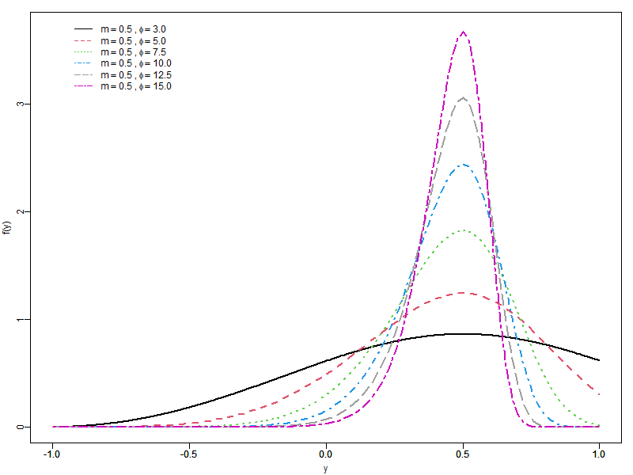

<div class="text-justify">


# Modal Truncated Weibull (MTW)


This repository contains the code and simulations used in the article associated with the new modal regression based on Weibull truncated distribution, including applications and a simulation study.


---


## Applications

- **USA_election/**:  Analysis and modeling of the 2016 U.S. election dataset.

- **Simulation/**: Monte Carlo simulations comparing the performance of models under different conditions.


---


## How to reproduce the results

1. Clone or download this repository.
2. Open the `MTWR.Rproj` file in RStudio.
3. Install the required R packages (see next section).
4. Run the script corresponding to the section of interest:
   - `USA_election/main_USA.R`
   - `Simulation/R/results_scenarioA.R`
   - `Simulation/R/results_scenarioB.R`


---


## Required R packages

Each script in this project loads the packages it needs. Below is the full list of R packages used:

- tidyverse (includes ggplot2, dplyr, tidyr, purrr, etc.)
- here
- VGAM
- betareg
- hnp
- MASS
- maxLik
- car
- Formula
- moments
- xtable
- ggthemes
- PNWColors
- usmap
- Stat2Data


---


Use this to install them all:

```r
install.packages(c(
  "VGAM", "tidyverse", "hnp", "betareg", "Stat2Data", "usmap",
  "PNWColors", "car", "ggthemes", "MASS", "reshape2", "reshape", "maxLik", "here"
))
```


---


## Data

- The `USA_election` folder uses the **Election16** and **statepop** datasets from the **Stat2Data** and **usmap** packages.

- Simulated datasets are generated within the `Simulation/`.


---


## Example

This section presents an example using the **modal truncated Weibull** distribution in the context of modeling and visualizing data from the **2016 U.S. presidential election**. We first illustrate the behavior of the distribution under different parameter settings, highlighting its flexibility in modeling skewed and bounded data. Then, we apply it to a real-world dataset to explore its potential in regression modeling.

### Density Behavior

These plots demonstrate how the shape parameter φ affects the distribution's skewness and peakedness, highlighting its adaptability to various data patterns.

<!-- PDF -->
<table>
  <tr>
    <td></td>
    <td></td>
  </tr>
</table>

**Figure 1.** *Probability density functions of the MTW distribution under different shape parameters φ, with fixed location parameters \(m = -0.7\) (left) and \(m = 0.5\) (right).*

### Real-world dataset

The map below provides a preliminary visualization based on electoral data, serving as a motivating example for applying the MTW model to real-world data.

<!-- map -->
<p align="center">
  
</p>


---


## Simulation Study Structure and Outputs

Results for each sample size ```(n = 20, 30, 40, 50, 100, 200, 500)``` were obtained via Monte Carlo simulations and saved in ```.RData``` files. These results correspond to two different scenarios (```Scenario A``` and ```Scenario B```) and are organized within the ```Simulation/``` folder as follows:

- ```Simulation/simulated_data/```: contains all raw simulation outputs (.RData files), including objects such as a1, a2, ..., a7, where each corresponds to a different sample size.


- ```Simulation/summary_tables/```: includes processed results in .Rds format (e.g., Monte Carlo means, bias, RMSE, kurtosis, skewness) for each scenario and sample size.


- ```Simulation/figures/```: stores .png files with boxplots.


- ```Simulation/R/```: contains all simulation scripts and supporting functions:


- ```scenarioA_simulation.R``` and ```scenarioB_simulation.R```: run the simulation processes for each scenario.


- ```results_scenarioA.R``` and ```results_scenarioB.R```: perform summaries, calculations, and visualizations of the results.


- ```functions_graph_summary.R```, ```otimizacaoWT.R```, and ```random_weibullT.R```: helper scripts used for custom random generation, model fitting, and plotting.


## Authors

- **Giordanna Oliveira Corrêa**

- **Dr. Jhonnata Bezerra de Carvalho**

- **Dr. Jeremias da Silva Leão**

- **Dra. Laís Helen Loose**

- **Dr. Moisés da Silva Melo**

</div>